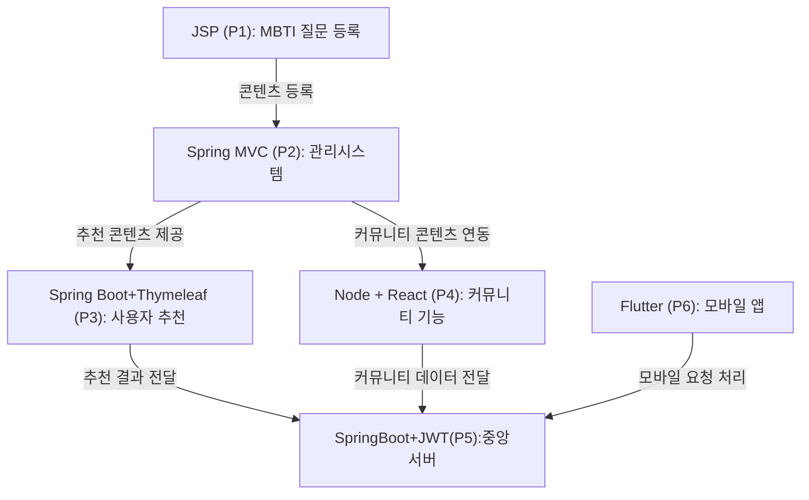

###  📦 project001_jsp-oracle


#### ■ 전체 콘셉트 : MBTI 기반 성향 맞춤 플랫폼  
> 성향 기반 콘텐츠 추천 + 감정 제어 + 커뮤니티 + 일정 연결을 통합한 라이프스타일 플랫폼  
> 기술 스택: JSP, Spring MVC, Spring Boot, Node.js, React, JWT, Redis, Flutter


##### 📌1. 기획의도 : 
MBTI Universe 는 성향기반으로 콘텐츠를 추천하고, 감정을 제어하며, 커뮤티니와 일정을 연결하는 통합 라이프스타일 플랫폼입니다. 다양한 기술스택을 활용해 모듈화된 구조로 개발되었으며 실무에서 요구되는 API 설계, 보안, UX 데이터 분석까지 모두 담았습니다.

<br>
<br>

##### 📌2. 연결구조



#####  📌 프로젝트 번호 요약

| 번호 | 기술 스택 | 주요 기능 |
|------|------------|------------|
| P1 | JSP + Oracle | MBTI 질문/보기 등록 |
| P2 | (#) Spring MVC + MyBatis + JSTL | 콘텐츠/질문/일정 관리 (관리자) |
| P3 |   Spring BOOT + JPA + Thymeleaf |사용자 추천, 테스트 결과 기반 콘텐츠 |
| P4 |   Node + React  | 커뮤니티, 취향 공유 |
| P5 | (#) Spring BOOT + JPA + React + JWT + Redis |  중앙 인증 서버, 통합 API  | 
| P6 | Flutter | 모바일 UX, 앱 인터페이스 |
 


<br>
<br>

---

#### 💡 공통 사용자 모듈 (중앙 인증 서버 기반)  
**기술 스택**: Spring Boot + JWT + Redis  
**역할**: 회원가입, 로그인, 인증/인가, MBTI 유형 관리

**공통 테이블**:

| 테이블명       | 설명 |
|----------------|------|
| `User`         | 사용자 기본 정보 (user_id, email, password, mbti_type_id, created_at 등) |
| `MbtiType`     | MBTI 유형 정보 (예: ENFP, INTJ 등) |
| `Role`         | 사용자 역할 (관리자, 일반 사용자 등) |
| `AuthToken`    | JWT 토큰 정보 (access_token, refresh_token, 만료일 등) |
| `LoginLog`     | 로그인 이력 (user_id, login_time, ip_address 등) |

→ **각 프로젝트에서 자체적으로 로그인 기능을 구현** (예: Spring Security, JWT, 세션 기반 등)

→ 이후에  **모든 로그인/회원가입/권한 관리를 중앙 인증 서버**에서 처리

→ 각 프로젝트는 **중앙 서버에서 발급된 JWT 토큰만 검증**하고, 사용자 정보를 받아서 `user_id`를 기반으로 기능 수행 


 


<br>
<br>

---

#### 💡 **PROJECT1** MBTI 테스트 + 결과보기
**기술 스택**: JSP + Oracle  
**기능**: MBTI 질문/보기 등록, 응답 저장
  1) JSP + Oracle: MBTI 질문/보기 등록 시스템
  2) 단순 CRUD지만, 실무에서 확장 가능한 데이터 기반 설계로 접근

>기초CRUD


**주요 테이블**:
| 테이블명       | 설명 |
|----------------|------|
| `Question`     | MBTI 질문 정보 (질문 텍스트, 등록자, 등록일 등) |
| `Choice`       | 각 질문에 대한 보기 (보기 텍스트, 연결된 MBTI 유형) |
| `MbtiType`     | MBTI 유형 정보 (예: ENFP, INTJ 등) |
| `QuestionLog`  | 사용자 응답 기록 (user_id, question_id, choice_id, timestamp) |
| `Tag`          | 질문에 연결된 콘텐츠 태그 |
| `QuestionAudit`| 질문 변경 이력 관리 (변경자, 변경일, 변경 내용) |

**아이디어**
1.  A/B 테스트 기반 질문 최적화: 사용자 응답 데이터를 기반으로 질문의 유효성을 분석하고, 정확도가 낮은 질문은 자동으로 교체하거나 개선 제안
2. 유형별 응답 히트맵: 어떤 질문에 어떤 유형이 많이 반응했는지 시각화하여 질문의 편향성 분석
3. 성향 기반 콘텐츠 티저: 테스트 결과에 따라 콘텐츠 미리보기(예: ENFP는 감성적인 음악, INTJ는 자기계발서) 제공
4. AI 기반 질문 자동 생성: 기존 질문 데이터를 학습해 새로운 질문을 제안하는 기능 (GPT API 연동 가능)
5. 질문/보기 등록 시 유형 자동 태깅: 키워드 기반으로 MBTI 유형 자동 추천
6. 질문/보기 등록 시 유효성 검증: 중복 질문, 오타, 유형 불일치 자동 감지
7. 콘텐츠 연결용 태그 시스템: 질문에 콘텐츠 태그를 붙여 향후 추천 시스템과 연결 가능
8. 질문/보기 등록 이력 관리: 등록자, 등록일, 수정이력 등을 기록하여 관리 기능 강화
9. 미사용 질문 관리 기능: 테스트에 사용되지 않는 질문을 자동 분류하여 보관 또는 삭제
10. 유형별 질문 분포 통계: 각 유형에 연결된 질문 수를 시각화하여 균형 확인 가능
 

<br/>
<br/>
<br/>
<br/>

---

#### 🚀 PART001 - MVC1 (스파게티 코드)


##### 🚀 1. 멤버관리

```sql
SQL> desc appuser
Name           Null?    Type
-------------- -------- ----------------------------
APP_USER_ID    NOT NULL NUMBER(5)
EMAIL          NOT NULL VARCHAR2(100)
PASSWORD                VARCHAR2(100)
MBTI_TYPE_ID            NUMBER(3)
CREATED_AT              DATE
```

<br/>
<br/>

##### 🚀 2. 프로젝트 구성

1. Dynamic Web Project 만들기: `project001`  
2. `ojdbc6.jar` 파일 셋팅  
3. `[inc]` - `header.js` / `footer.jsp`  
4. MVC1 + `PreparedStatement`  
   - 회원가입: `join.jsp` → `join_process.jsp`  
   - 로그인: `login.jsp` → `login_process.jsp` → `mypage.jsp`  

```html
<!-- 회원가입 form -->
<form action="join_process.jsp" method="post">
  <input name="email">
  <input name="password">
  <input name="mbti_type_id">
</form>

<!-- 로그인 form -->
<form action="login_process.jsp" method="post">
  <input name="email">
  <input name="password">
</form>
```
<br/>
<br/>

##### 🚀 3. 테이블 구조

| 컬럼명         | 데이터 타입     | 제약 조건     | 설명 |
|----------------|----------------|----------------|------|
| `app_user_id`  | `NUMBER(5)`     | `PRIMARY KEY`  | 사용자 고유 ID |
| `email`        | `VARCHAR2(100)` | `NOT NULL`     | 사용자 이메일 주소 |
| `password`     | `VARCHAR2(100)` | —              | 사용자 비밀번호 |
| `mbti_type_id` | `NUMBER(3)`     | —              | MBTI 유형 ID (`mbti_type` 테이블 참조 가능) |
| `created_at`   | `DATE`          | —              | 가입일 |
| —              | —               | `FOREIGN KEY`  | `mbti_type_id`는 `mbti_type(mbti_type_id)` 참조 가능 |

```sql
CREATE TABLE APPUSER (
  APP_USER_ID  NUMBER NOT NULL PRIMARY KEY,
  EMAIL        VARCHAR2(100) NOT NULL UNIQUE,
  PASSWORD     VARCHAR2(100),
  MBTI_TYPE_ID NUMBER,
  CREATED_AT   DATE,
  FOREIGN KEY (MBTI_TYPE_ID) REFERENCES appuser(MBTITYPE)
);
```
 <br/>
<br/>

##### 🚀 4. 유용한 기능들

1. `mypage` - 유형 1,2,3 자바코드 추가  
2. session: `first님`, `MbtiBoard` / 로그인 회원가입  
3. Oracle 시퀀스: 숫자 자동 카운트


<br/>
<br/>
<br/>
<br/>

---

#### 🚀 PART002 - MVC2

##### 📌 1. 게시판 기능

##### 📌 2. MVC1 vs MVC2

######  2-1. 구성 방식

- **MVC1**: JSP가 MODEL, VIEW, CONTROLLER 역할을 모두 수행  
- **MVC2**: MODEL(Java), VIEW(JSP), CONTROLLER(Servlet) 분리

######  2-2. 유지보수성

- **MVC1**: 낮음 (JSP에 로직 포함 → 재사용 어려움)  
- **MVC2**: 높음 (MODEL, CONTROLLER 재사용 가능)


<br/>
<br/>
<br/>


##### 📌 3. MVC2 구성 요소

- JAVA, SERVLET  
- Response  
- Board


<br/>
<br/>
<br/>


##### 📌 4. 프로젝트 구성

###### 📌 4-1. 기본 셋업

1. Dynamic Web Project 만들기: `project001`  
2. `ojdbc6.jar`, `jstl.jar`, `standard.jar` 파일 셋팅  
3. `[inc]` - `header.js` / `footer.jsp`  
4. MVC2 구조


<br/>
<br/>
<br/>


##### 📌 5. Model

###### 📌 5-1. Table: `post` + Sequence: `post_seq`

| 컬럼명        | 데이터 타입     | 제약 조건         | 설명 |
|---------------|----------------|--------------------|------|
| `id`          | `NUMBER`        | `PRIMARY KEY`      | 게시글 고유 ID |
| `app_user_id` | `NUMBER`        | `NOT NULL`         | 작성자 ID (`appuser` 테이블 참조) |
| `title`       | `VARCHAR2(200)` | `NOT NULL`         | 게시글 제목 |
| `content`     | `CLOB`          | `NOT NULL`         | 게시글 내용 |
| `pass`        | `VARCHAR2(100)` | —                  | 비회원 삭제용 비밀번호 |
| `created_at`  | `DATE`          | `DEFAULT SYSDATE`  | 작성일 |
| `hit`         | `NUMBER`        | `DEFAULT 0`        | 조회수 |
| —             | —               | `FOREIGN KEY`      | `app_user_id`는 `appuser(app_user_id)` 참조 |

```sql
CREATE TABLE post (
  id            NUMBER PRIMARY KEY,
  app_user_id   NUMBER NOT NULL,
  title         VARCHAR2(200) NOT NULL,
  content       CLOB NOT NULL,
  pass          VARCHAR2(100),
  created_at    DATE DEFAULT SYSDATE,
  hit           NUMBER DEFAULT 0,
  FOREIGN KEY (app_user_id) REFERENCES appuser(app_user_id)
);

CREATE SEQUENCE post_seq;
```

###### 📌 5-2. DTO

- `com.thejoa703.dto` → `PostDto`

###### 📌 5-3. DAO

- `com.thejoa703.dao` → `PostDao`

###### 📌 5-4. 주요 SQL 및 메서드

```java
// 글쓰기
insert into post (id, app_user_id, title, content, pass)
values (post_seq.nextval, ?, ?, ?, ?);

// 전체보기
SELECT p.*, u.email
FROM post p JOIN appuser u ON p.app_user_id = u.app_user_id;

// 상세보기
select * from post where id = ?;
update post set hit = hit + 1 where id = ?;

// 글수정
update post set title = ?, content = ? where id = ? and pass = ?;

// 글삭제
delete from post where id = ? and pass = ?;
```

<br/>
<br/>
<br/>


##### 📌 6. View

- `list.jsp`  
- `write.jsp`  
- `detail.jsp`  
- `edit.jsp`  
- `delete.jsp`


<br/>
<br/>
<br/>


##### 📌 7. Controller

###### 📌 7-1. FrontController

- `@WebServlet` 개발용: `*.do`, `*.member`, `*.hj`  
- `web.xml` 배포용

```text
index.jsp
├── [전체글보기] /list.do         → MbtiList        → mbtiBoard/list.jsp
├── [글쓰기폼]   /writeView.do    →                 → mbtiBoard/write.jsp
├── [글쓰기기능] /write.do        → MbtiInsert      → 알림창 + list.do
├── [상세보기]   /detail.do       → MbtiDetail      → mbtiBoard/detail.jsp
├── [글수정폼]   /editView.do     → MbtiUpdateView  → mbtiBoard/edit.jsp
├── [글수정기능] /edit.do         → MbtiUpdate      → 알림창 + detail.jsp
├── [글삭제폼]   /deleteView.do   →                 → mbtiBoard/delete.jsp
├── [글삭제기능] /delete.do       → MbtiDelete      → 알림창 + list.do
```

- `com.thejoa703.controller` → `MbtiController`


<br/>
<br/>
<br/>


###### 📌 7-2. Service

- `com.thejoa703.service`  
- `MbtiService <<interface>>`

```text
△ MbtiList        → 데이터 X / selectAll()
△ MbtiInsert      → 데이터 O / insert(PostDto dto)
△ MbtiDetail      → 데이터 O / select(int id), update_hit(int id)
△ MbtiUpdateView  → 데이터 O / select(int id)
△ MbtiUpdate      → 데이터 O / update(PostDto dto)
△ MbtiDelete      → 데이터 O / update(PostDto dto)
```
 
<br/>
<br/>
<br/>


##### 📌 8. 유용한 기능들

1. `<%=request.getContextPath()%>` / `${pageContext.request.contextPath}`  
2. 게시글 내림차순 정렬  
3. 로그인한 사용자만 글쓰기/수정/삭제 버튼 표시
